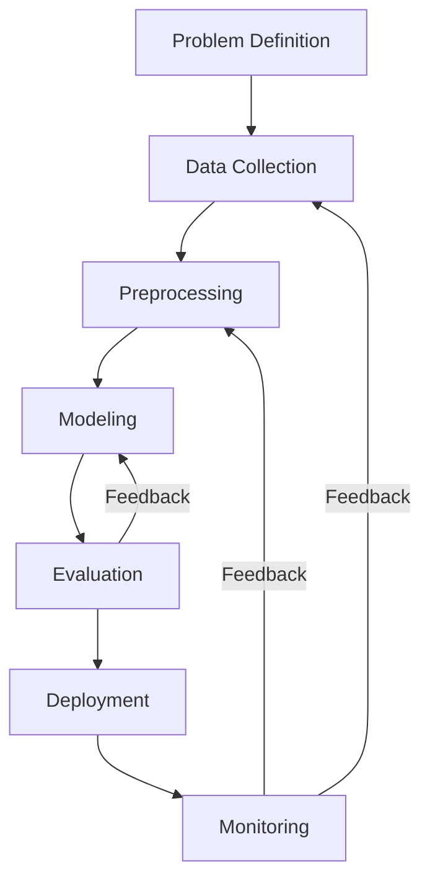

# Reflection & Workflow Diagram

## Reflection

**Most challenging part of the AI workflow and why:**
- The most challenging part was data collection and preprocessing. Gathering high-quality, relevant data is often time-consuming, and dealing with missing values, inconsistencies, and potential biases requires careful attention. These steps are critical because poor data quality can undermine the entire AI project.

**How the approach would improve with more time, data, or computing resources:**
- With more time, we could perform more thorough exploratory data analysis and feature engineering, potentially uncovering additional predictive factors.
- Access to more data would improve model generalizability and allow for more robust validation.
- Greater computing resources would enable the use of more complex models and more extensive hyperparameter tuning, possibly leading to better performance.

---

## AI Development Workflow Diagram

